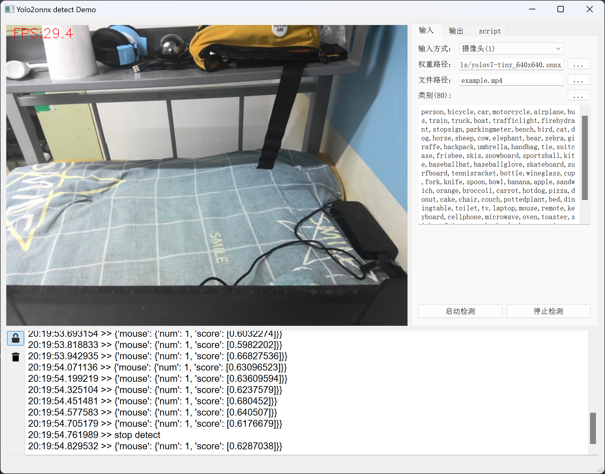
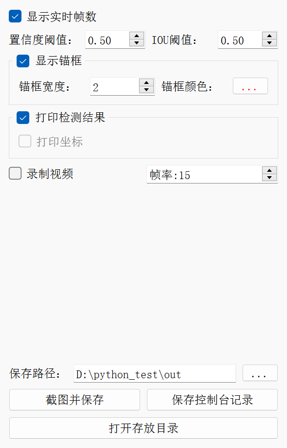
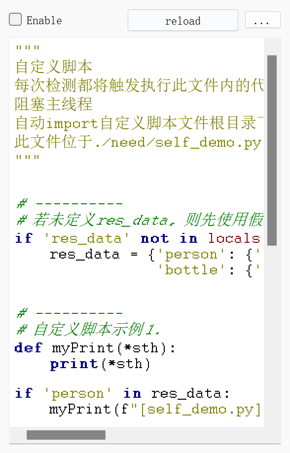

# 基于Yolov5 + PyQt5 + onnxruntime的目标检测部署

>### 实现：
>
> - Yolov5训练个人数据集
> - 使用官方命令转换为onnx格式
> - 使用onnxruntime进行检测
> - 并在Windows平台打包为可执行程序

### 展示
**主界面**

**功能**
1. 实时帧数
2. 重定向控制台输出到软件界面上
3. 更改检测置信度、IOU阈值
4. 显示/关闭锚框、更改锚框宽度及颜色
5. 打印/隐藏检测结果
6. 录制检测视频
7. 保存实时截图、控制台记录
8. 自定义脚本，每次检测都将触发，(详细说明请阅读need/self_demo.py)

>### 使用方法：
> 
> - clone项目到本地
> - 安装依赖`pip install -r requirements.txt`
> - 运行`Yolo2onnxDetectProjectDemo.py`
> - 如果不报错的话将会出现界面
> - 点击`启动检测`按钮开始检测，高阶玩法参考`need/self_demo.py`

>### 打包为可执行文件
> 
> - 执行`build.py`，打包好的文件位于`build_file/publish`文件夹
> - 所用库为nuitka，打包命令已经在`build.py`中配置好，如需更高级玩法请自己摸索
> - 附nuitka的使用方法：[知乎@Python与模具](https://zhuanlan.zhihu.com/p/341099225)

>## 项目需求 (详见requirements.txt)
>
> - python == 3.9
> - numpy == 1.23.4
> - opencv-python == 4.5.5.62
> - PyQt5 == 5.15.7
> - onnxruntime == 1.13.1
> - nuitka == 0.6.18.4

### 仓库自带两个onnx模型，一个是官方的yolov7-tiny_640x640.onnx，一个是自己训练的安全帽识别模型，位于need/models文件夹

>## 训练自己的数据集
> 
> - 所用Yolov5版本为5.0，如果想兼容其他版本请自行修改代码，[Yolov5 v5.0传送门](https://github.com/ultralytics/yolov5/tree/v5.0)
> - 训练完成后按照[官方命令](https://github.com/ultralytics/yolov5/issues/251)转为onnx格式。本仓库的模型转换命令为`python models/export.py --weights ./weights/yolov5s.pt --img 640 --batch 1`

# **如遇问题，请提issue**